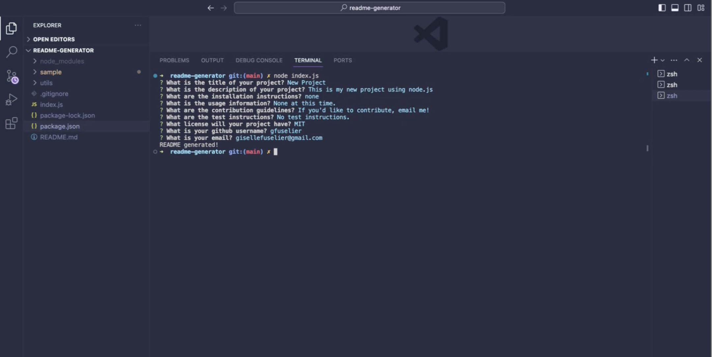

# readme-generator

## Description
The README Generator is a command-line application that lets users quickly make a README file by answering prompts. The app takes the data from the user's input and generates a README with a title and sections titled description, table of contents, installation, usage, license, contribution, tests, and questions. The README Generator is written with JavaScript and uses node.js and inquirer.

## Usage

Watch the walkthrough video [here](https://drive.google.com/file/d/1jwbKqH-FhX98GC_IF40i1zkoIGaTYX7N/view).

## Credits
None

## License
N/a